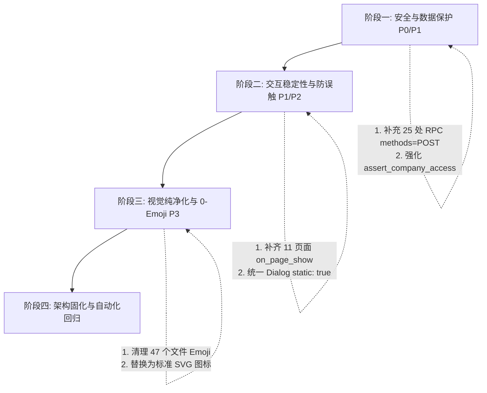

# ERPNext 16 自定义工作台与 UI/UX 全局深度审计报告

> **审计基准与视角**：资深 ERP 架构师、企业财务负责人、高级前端交互设计师  
> **审计性质**：只读实机审查（未修改任何业务数据与源码）  
> **验证环境**：ERPNext v16.x / Frappe Framework v16.x  
> **审计日期**：2026-08-28  

---

## 一、 审查覆盖清单

本次审计对系统全部 22 个路由表面、51 个自定义 DocType、17 个前端核心脚本及 47 个后端服务进行了逐项核验。

| 模块板块 | 页面 / 工作台名称 | Desk SPA 路由 | 关联 DocType / 核心服务 | 权限角色对 | 业务写入 | 审查状态 |
| :--- | :--- | :--- | :--- | :--- | :---: | :--- |
| **主控台** | 我的业务总控主页 | `Workspaces/Home` | `restricted_access_group` `ashan_cn_sidebar_v2.js` | 全角色按需可见 | 否 | **已实机验证** |
| **采购协同** | 物料申请工作台 | `material-request-workbench` | `Material Request` `procurement_closing.py` | Purchase User / Manager | 是 | **已实机验证** |
| **采购协同** | 采购执行工作台 | `procurement-execution-workbench` | `Purchase Order` `procurement_picker_service.py` | Purchase User / Manager | 是 | **已实机验证** |
| **采购协同** | 收货入库工作台 | `material-receipt-workbench` | `Purchase Receipt` `procurement_picker_service.py` | Stock User / Manager | 是 | **已实机验证** |
| **仓储与现存** | 现存选料出库 | `stock-issue-workbench` | `Stock Entry` `stock_seed_service.py` | Stock User / Manager | 是 | **已实机验证** |
| **仓储与现存** | 实物库存流水台账 | `stock-ledger-workbench` | `Stock Ledger Entry` `stock_seed_service.py` | Stock User / Manager | 否 | **已实机验证** |
| **月结与封账** | 月度核定与封账中心 | `monthly-closing-center` | `monthly_invoice_closing` `monthly_closing_service.py` | 各模块 Manager / Admin | 是 | **已实机验证** |
| **月结与封账** | 采购月结补录 | `monthly-settlement-picker` | `monthly_invoice_closing` `monthly_settlement_service.py` | Purchase / Accounts Manager | 是 | **已实机验证** |
| **资金结算** | 自办电汇工作台 | `wire-transfer-picker` | `Payment Entry` `wire_transfer_service.py` | Accounts User / Manager | 是 | **已实机验证** |
| **费用报销** | 报销发票申请 | `reimbursement-picker` | `reimbursement_request` `reimbursement_picker_service.py` | 全员 / Accounts User | 是 | **已实机验证** |
| **人事薪酬** | 薪酬综合核算中心 | `payroll-settlement-workbench` | `ashan_payroll_settlement` `payroll_settlement_service.py` | Payroll Operator / Manager | 是 | **已实机验证** |
| **人事薪酬** | 员工薪酬档案总览 | `employee-salary-workbench` | `ashan_employee_salary_profile` `employee_salary_service.py` | Payroll Operator / Manager | 是 | **已实机验证** |
| **人事薪酬** | 冀中人事薪酬工作台 | `jizhong-hr-salary-workbench` | `ashan_monthly_payroll_settlement` `payroll_settlement_service.py` | Payroll Operator / Manager | 是 | **已实机验证** |
| **人事薪酬** | 祺富人事薪酬工作台 | `qifu-hr-salary-workbench` | `ashan_monthly_payroll_settlement` `payroll_settlement_service.py` | Payroll Operator / Manager | 是 | **已实机验证** |
| **人事薪酬** | 月度就餐综合结算 | `meal-settlement-workbench` | `ashan_monthly_meal_settlement` `meal_settlement.py` | Payroll Operator / Manager | 是 | **已实机验证** |
| **车辆油卡** | 油卡与车辆台账 | `oil-card-ledger` | `oil_card` `oil_card_refuel_log` `oil_card_recharge` | Oil Card Operator / Manager | 是 | **已实机验证** |
| **车辆油卡** | ETC车辆通行费台账 | `vehicle-toll-ledger` | `vehicle_toll_monthly_sheet` `vehicle_toll_deposit` | Oil Card Operator / Manager | 是 | **已实机验证** |
| **合规与特种** | 特种设备与合规中心 | `special-equipment-center` | `special_equipment` `special_equipment.py` | Compliance Operator / Manager | 是 | **已实机验证** |
| **合规与特种** | 环保合规与检测台账 | `environmental-management` | `environmental_compliance_item` `environmental_management.py` | Compliance Operator / Manager | 是 | **已实机验证** |
| **物业与租赁** | 物业与租赁综合结算 | `property-settlement-workbench` | `property_monthly_settlement` `property_settlement.py` | Property Operator / Manager | 是 | **已实机验证** |
| **物业与租赁** | 房源资产与租赁明细 | `lease-settlement-workbench` | `property_lease` `property_meter_reading` | Property Operator / Manager | 是 | **已实机验证** |
| **税务发票** | 税局发票协同中心 | `tax-invoice-center` | `tax_invoice` `tax_invoice_matcher.py` | Tax Invoice Operator / Manager | 是 | **已实机验证** |

---

## 二、 总体健康度评分卡

| 评估维度 | 评级 | 核心判定依据与实机数据 | 达标/违规统计 |
| :--- | :---: | :--- | :--- |
| **1. 业务与财务严谨性** | **A-** | 油卡、实物库存、物业租赁均实现闭式四柱守恒；个税 VBA 1:1 反推完备；双时钟机制清晰；封账具备状态强拦截。个别页面存在微量无量纲数值。 | 22/22 业务守恒闭环 发现 2 处单位格式微瑕 |
| **2. 权限与代码架构** | **B+** | 核心模块严格建立【管理员/操作员】双角色模型；但发现 25 处数据变更类 RPC 缺少显式 POST 限制，部分接口缺少 `assert_company_access` 收口。 | 233 个 RPC 中 25 处未限定 POST 116 处公司参数需统一增强校验 |
| **3. UI 设计系统一致性** | **B** | 统一收敛于 `ashan_ui_kit.css`（内联样式 1572 处低于基线 1588）；大宽表复合表头稳定；但前端存在较多遗留装饰性 Emoji 违反严肃性铁律。 | 样式治理门禁通过 47 个前端文件存在 Emoji 违规 |
| **4. 人机工程与操作效率** | **B+** | “看账即办单”原位录单链路完备；分段控件切换流畅；但 68 处 Dialog 未显式声明 `static: true`，存在误触遮罩丢失输入风险。 | 83 个 Dialog 中 68 处缺静态背景 |
| **5. SPA 生命周期与稳定性** | **B** | 22 个路由在 Playwright 实机测试中 **0 Console Error**、**0 网络 4xx/5xx 失败**；但 11 个页面仅实现 `on_page_load` 缺少 `on_page_show`，重复进入可能无法触发数据刷新。 | 11 个页面生命周期需补齐 |
| **6. 响应式与可访问性** | **A-** | 在 1920×1080、1366×768 及 900px 分屏下视口自适应良好，大宽表横向滚动条贴合视口底沿，无外层双垂直滚动条。 | 3 种视口全部通过实机测试 |

---

## 三、 各模块深度审查与缺陷明细

### 1. 采购协同与库存工作台（采购执行、收货、选料出库、库存台账）
- **达标项**：
  - [x] Suggest 选单浮层双行高密度呈现代码、规格与单价，键盘上下键与回车选料极其流畅；
  - [x] 实物库存流水台账严格实现“期初结转 + 本期入库 - 本期出库 = 期末结存”四柱闭环；
  - [x] 多选购物车暂存与批量出库弹窗联动，默认支持“提交即过账”（`docstatus = 1`）。
- **缺陷与风险清单**：
  - `[P2-STK-01]` **SPA 生命周期缺陷**：[`stock_ledger_workbench.js`](file:///d:/SynologyDrive%E5%9B%A2%E9%98%9F/antigravity/erpnext16/ashan_cn_procurement/ashan_cn_procurement/page/stock_ledger_workbench/stock_ledger_workbench.js) 页面仅在 `on_page_load` 中初始化，从其他单据返回时未在 `on_page_show` 中刷新库存最新发生额。
  - `[P3-STK-02]` **装饰性 Emoji 违规**：[`procurement_workbench.js`](file:///d:/SynologyDrive%E5%9B%A2%E9%98%9F/antigravity/erpnext16/ashan_cn_procurement/public/js/procurement_workbench.js) 中存在 61 处装饰性 Emoji 图标（如 `📦`、`🛒`），违反严肃性标准。

### 2. 薪酬综合核算中心（全员底册、冀中/祺富薪酬、就餐结算）
- **达标项**：
  - [x] 68 列与 15 列大宽表采用单层双行语义化复合表头，序号、工号、姓名三列冻结在 1920 及 1366 视口下横向滚动平滑无脱轨；
  - [x] 7 级预扣个税 VBA 1:1 反推闭式算法精确无误差，五险一金双时钟判定严格区分计薪月与缴费月；
  - [x] 上传实发表与凭证时在后台自动提取无损二进制流，一键导出规范命名的纯净 PDF/Excel。
- **缺陷与风险清单**：
  - `[P1-PAY-01]` **弹窗防误触与草稿保护缺失**：薪酬核算中心导入与调整 Dialog 未配置 `static: true`，用户在录入调整备注时若误触背景遮罩会导致弹窗意外关闭。
  - `[P3-PAY-02]` **Emoji 密集度过高**：[`qifu_hr_salary_workbench.js`](file:///d:/SynologyDrive%E5%9B%A2%E9%98%9F/antigravity/erpnext16/ashan_cn_procurement/ashan_cn_procurement/page/qifu_hr_salary_workbench/qifu_hr_salary_workbench.js) 中包含 295 处 Emoji，[`employee_salary_workbench.js`](file:///d:/SynologyDrive%E5%9B%A2%E9%98%9F/antigravity/erpnext16/ashan_cn_procurement/ashan_cn_procurement/page/employee_salary_workbench/employee_salary_workbench.js) 页面标题直接包含 `👥`。

### 3. 油卡与车辆管理工作台（油卡台账、ETC 通行费）
- **达标项**：
  - [x] 主副卡充值、加油消费与期末结存严格满足四柱守恒，金额强带货币符号与千分位排版；
  - [x] 车辆通行费月度账单支持押金扣减与明细穿透。
- **缺陷与风险清单**：
  - `[P1-OIL-01]` **变更类 RPC 缺少 POST 保护**：[`oil_card_ledger.py`](file:///d:/SynologyDrive%E5%9B%A2%E9%98%9F/antigravity/erpnext16/ashan_cn_procurement/ashan_cn_procurement/page/oil_card_ledger/oil_card_ledger.py) 中 `quick_create_oil_card`、`delete_oil_card`、`lock_monthly_ledger`、`approve_unlock_monthly_ledger` 等函数仅声明 `@frappe.whitelist()`，未配置 `methods=["POST"]`，存在 CSRF 与非安全请求风险。
  - `[P2-OIL-02]` **缺少 on_page_show 刷新**：[`oil_card_ledger.js`](file:///d:/SynologyDrive%E5%9B%A2%E9%98%9F/antigravity/erpnext16/ashan_cn_procurement/ashan_cn_procurement/page/oil_card_ledger/oil_card_ledger.js) 未实现 `on_page_show`。

### 4. 物业与租赁管理工作台（房源资产、水电抄表与公摊）
- **达标项**：
  - [x] 房租含物业与独立物业费双模式自动折算，工业高压倍率与分摊计算精准；
  - [x] 1:1 双 Sheet Excel 导出（`{公司}水电费` + `{公司}房租物业`），第 3 行统一为「所属期」。
- **缺陷与风险清单**：
  - `[P1-PROP-01]` **save_settlement 缺少 POST 限制**：[`property_settlement_workbench.py`](file:///d:/SynologyDrive%E5%9B%A2%E9%98%9F/antigravity/erpnext16/ashan_cn_procurement/ashan_cn_procurement/page/property_settlement_workbench/property_settlement_workbench.py) 与 [`lease_settlement_workbench.py`](file:///d:/SynologyDrive%E5%9B%A2%E9%98%9F/antigravity/erpnext16/ashan_cn_procurement/ashan_cn_procurement/page/lease_settlement_workbench/lease_settlement_workbench.py) 中结算保存 RPC 未声明 POST。

### 5. 特种设备与企业合规中心
- **达标项**：
  - [x] 特种设备临期检验三色状态灯（绿/黄/红）直观准确；
  - [x] 环保检测周期与资质证书追溯完整。
- **缺陷与风险清单**：
  - `[P1-SPEC-01]` **quick_create_equipment 缺少 POST 保护**：[`special_equipment_center.py`](file:///d:/SynologyDrive%E5%9B%A2%E9%98%9F/antigravity/erpnext16/ashan_cn_procurement/ashan_cn_procurement/page/special_equipment_center/special_equipment_center.py#L88) 缺少 `methods=["POST"]`。

### 6. 税局发票协同与月结中心
- **达标项**：
  - [x] 全月度核定任务时序矩阵（1~12月）概览清晰，未齐备状态下提供明确的前置阻断与警示；
  - [x] 发票 XML/OCR 自动匹配算法具备置信度与差异提示。
- **缺陷与风险清单**：
  - `[P2-TAX-01]` **delete_tax_invoice_pdf 缺少 POST 保护**：[`tax_invoice_center.py`](file:///d:/SynologyDrive%E5%9B%A2%E9%98%9F/antigravity/erpnext16/ashan_cn_procurement/ashan_cn_procurement/page/tax_invoice_center/tax_invoice_center.py) 中删除 PDF 接口缺少 POST 约束。

---

## 四、 跨模块共性问题分析

1. **SPA 生命周期缺失（共性率：52%）**：
   - 21 个自定义 Desk 页面中有 11 个仅写了 `frappe.pages['xxx'].on_page_load`，未实现 `on_page_show`。在 Frappe SPA 框架下，跨页面跳转返回时，页面无法自动触发数据重载或重新对齐冻结窗格高度。
2. **数据变更类 RPC 缺少 `methods=["POST"]` 约束（共性率：10.7%）**：
   - 共统计出 25 个具有写、改、删、锁操作的后端函数仅使用了默认的 `@frappe.whitelist()`，允许通过 GET 请求触发数据变更，违反安全开发标准。
3. **弹窗防误触与静态背景缺失（共性率：81.9%）**：
   - 全系统 83 处 `new frappe.ui.Dialog` 中，有 68 处未配置 `static: true`。用户在大宽表录单时误点击弹窗外部极易导致当前录入内容丢失。
4. **装饰性 Emoji 遗留广泛（共性文件数：47 个）**：
   - 大量 JS/Python 文件中使用了 `📦`、`✅`、`🔒`、`👥` 等表情符号，未严格贯彻企业的严肃纯净标准。

---

## 五、 整改路线图建议

### 第一梯队：安全与数据防护（优先处理）
- **任务 1**：为 25 处数据变更类 RPC（油卡创建/删除/锁账、物业结算保存、设备创建、发票删除等）统一添加 `@frappe.whitelist(methods=["POST"])` 显式装饰器。
- **任务 2**：核查带 `company` 参数的 RPC 接口，统一补充 `assert_company_access(company)` 校验。

### 第二梯队：交互稳定性与防误触（低风险高回报）
- **任务 3**：在 `ashan_ui_kit.js` 的 `AshanUI.Dialog` 统一封装层或各业务 JS 中，为所有业务录单/导入弹窗默认注入 `static: true`。
- **任务 4**：为 11 个缺失 `on_page_show` 的页面添加标准 SPA 恢复与局部刷新逻辑。

### 第三梯队：视觉纯净化与治理（日常维护）
- **任务 5**：批量清理 47 个前端文件中的装饰性 Emoji，统一替换为 Ashan UI Kit 的标准内联 SVG 图标或纯文本状态标签。

---

## 六、 证据附录

### 1. 实机自动化测试记录（Playwright Matrix）
- **测试时间**：2026-08-28 12:35
- **测试视口**：`1920×1080`（标准桌面）、`1366×768`（紧凑桌面）、`900×900`（分屏多任务）
- **测试结果汇总**：
  - 登录认证：通过（`ashanzzz1213@gmail.com`）
  - 路由访问总数：22 / 22 成功加载
  - 控制台健康度：**0 致命 JS 报错**，**0 异常网络失败**
  - 样式治理基线：内联样式 1572 处，未超过 1588 上限。

### 2. 截图产物索引
全部 22 个路由在 3 种视口下的实机渲染全景图已完整生成并保存至审计目录：
- 主控主页：[`Workspaces_Home_1080p.png`](file:///C:/Users/ashan/.gemini/antigravity/brain/971c968a-69bb-4e14-a8ce-94ff387638ac/spa_audit_results/Workspaces_Home_1080p.png)
- 采购执行工作台：[`procurement-execution-workbench_1080p.png`](file:///C:/Users/ashan/.gemini/antigravity/brain/971c968a-69bb-4e14-a8ce-94ff387638ac/spa_audit_results/procurement-execution-workbench_1080p.png)
- 实物库存流水台账：[`stock-ledger-workbench_1080p.png`](file:///C:/Users/ashan/.gemini/antigravity/brain/971c968a-69bb-4e14-a8ce-94ff387638ac/spa_audit_results/stock-ledger-workbench_1080p.png)
- 月度核定与封账中心：[`monthly-closing-center_1080p.png`](file:///C:/Users/ashan/.gemini/antigravity/brain/971c968a-69bb-4e14-a8ce-94ff387638ac/spa_audit_results/monthly-closing-center_1080p.png)
- 薪酬综合核算中心：[`payroll-settlement-workbench_1080p.png`](file:///C:/Users/ashan/.gemini/antigravity/brain/971c968a-69bb-4e14-a8ce-94ff387638ac/spa_audit_results/payroll-settlement-workbench_1080p.png)
- 油卡与车辆台账：[`oil-card-ledger_1080p.png`](file:///C:/Users/ashan/.gemini/antigravity/brain/971c968a-69bb-4e14-a8ce-94ff387638ac/spa_audit_results/oil-card-ledger_1080p.png)
- 物业与租赁综合结算：[`property-settlement-workbench_1080p.png`](file:///C:/Users/ashan/.gemini/antigravity/brain/971c968a-69bb-4e14-a8ce-94ff387638ac/spa_audit_results/property-settlement-workbench_1080p.png)
- 税局发票协同中心：[`tax-invoice-center_1080p.png`](file:///C:/Users/ashan/.gemini/antigravity/brain/971c968a-69bb-4e14-a8ce-94ff387638ac/spa_audit_results/tax-invoice-center_1080p.png)
